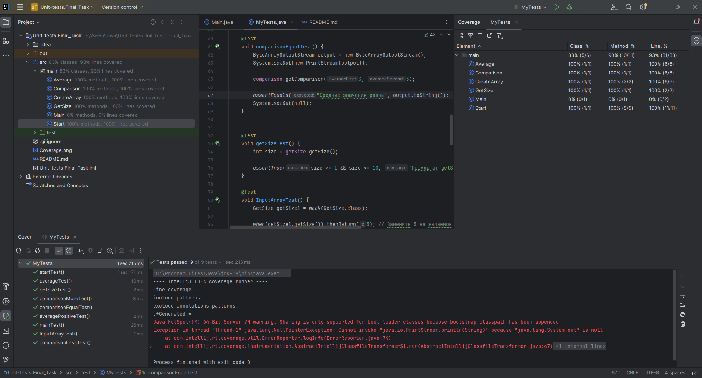

## Создать и протестировать программу, которая принимает два списка чисел и сравнивает их среднее арифметеческое значение ##

### Отчет о покрытии тестами ###

### Объяснение сценариев. ###
* @Test
void averagePositiveTest()  - позитивная проверка на правильность подсета методом getAverage среднего аривметического значения.
* void comparisonMoreTest(), void comparisonLessTest(), void comparisonEqualTest() - проверка метода getComparison на правильность сравнения и вывода сообщения.
* void getSizeTest() - проверка метода getSize() на соблюдение диапазона при генерировании значения размера массива.
* void InputArrayTest() - проверка метода inputArray(int size) на правильность создания массива (null, длина, диапазона для генерации чисел).
* void startTest() - проверка на правильность работы метода start(), который использует методы из других классов.
* void averageTest() - проверка на правильность работы метода average() в классе Start, используются моки двух разных классов.
* void mainTest() - проверка на правильность работы метода main.

